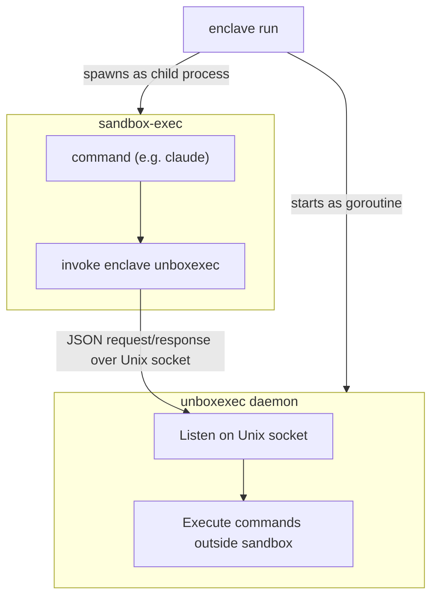

# enclave

[](https://github.com/kohkimakimoto/enclave/actions/workflows/test.yml)
[](https://github.com/kohkimakimoto/enclave/releases)
[](https://github.com/kohkimakimoto/enclave/blob/main/LICENSE)

A tool to run any command in a sandboxed environment using macOS's `sandbox-exec`.

> [!NOTE]
> This project was previously called **claude-sandbox** and was designed specifically to run Claude Code in a sandboxed environment. Starting from v3, it has been redesigned and renamed to **enclave** to support running any command — not just Claude Code, but any AI agent or arbitrary command — inside a sandbox.

Table of Contents:
- [Why Not the Built-in Sandbox?](#why-not-the-built-in-sandbox)
- [Installation](#installation)
  - [Homebrew](#homebrew)
  - [Build from source](#build-from-source)
- [Usage](#usage)
- [Configuration File](#configuration-file)
  - [Creating a Configuration File](#creating-a-configuration-file)
  - [Example](#example)
  - [Configuration Keys](#configuration-keys)
  - [Sandbox Profile Parameters](#sandbox-profile-parameters)
  - [Viewing the Sandbox Profile](#viewing-the-sandbox-profile)
  - [Viewing the Effective Configuration](#viewing-the-effective-configuration)
- [Sandbox-External Command Execution](#sandbox-external-command-execution)
  - [The `unboxexec` Subcommand](#the-unboxexec-subcommand)
    - [Options](#options)
    - [Examples](#examples)
  - [Command Restrictions](#command-restrictions)
  - [Architecture](#architecture)
- [Environment Variables](#environment-variables)
- [Agent Skill](#agent-skill)
- [License](#license)


## Why Not the Built-in Sandbox?

Claude Code provides a [built-in sandboxing feature](https://code.claude.com/docs/en/sandboxing) with filesystem and network isolation. I tried it, but in my workflow and environment it wasn't the best fit:

- Unexpected restrictions kept blocking legitimate operations, and I spent a lot of time troubleshooting and working around them.
- I didn't need network isolation at all, so it only added complexity without benefit.

What I actually needed was simpler: **restrict file writes to the current directory** and **explicitly allow exceptions** when needed. So I built this tool — minimal, predictable sandboxing with straightforward configuration.

## Installation

### Homebrew

```bash
brew install kohkimakimoto/tap/enclave
```

### Build from source

```bash
git clone https://github.com/kohkimakimoto/enclave.git
cd enclave
make build
# Binary is at .dev/build/dev/enclave
```

## Usage

Use `enclave run` to run any command inside the sandbox:

```bash
# Run Claude Code in the sandbox
enclave run claude --dangerously-skip-permissions

# Run GitHub Copilot CLI in the sandbox
enclave run copilot

# Run any arbitrary command
enclave run ls -la
```

Use `--config` to specify a custom configuration file:

```bash
enclave run --config copilot-sandbox.toml copilot
```

Use `--` to clearly separate enclave's own options from the command's arguments:

```bash
enclave run --config my.toml -- claude -p "hello"
```

## Configuration File

Settings are managed through TOML configuration files with three scopes. Each scope overrides the previous one for any field that is explicitly set:

1. **User**: `$XDG_CONFIG_HOME/enclave/config.toml` (or `~/.config/enclave/config.toml`) — applies to all projects for the current user
2. **Project**: `./enclave.toml` in the working directory — project-specific settings checked into version control
3. **Local**: `./enclave.local.toml` in the working directory — local overrides not meant to be committed (e.g. personal command allowlists)

You can also specify a config file directly with `--config`, which takes precedence over all of the above.

If no config files exist, built-in defaults are used.

### Creating a Configuration File

Create a project-specific configuration:

```bash
enclave init
```

This creates `enclave.toml` in your current directory.

Create a local override configuration (not for version control):

```bash
enclave init-local
```

This creates `enclave.local.toml` in your current directory. Use this for personal or machine-specific settings that should not be committed. Add it to `.gitignore`.

Create a user-level configuration:

```bash
enclave init-user
```

This creates `~/.config/enclave/config.toml`.

### Example

```toml
# ~/.config/enclave/config.toml   (user)
# ./enclave.toml                  (project)
# ./enclave.local.toml            (local overrides)

# Sandbox profile for sandbox-exec.
# If not set, the built-in default profile is used.
sandbox_profile = '''
(version 1)
(allow default)
(deny file-write*)
(allow file-write*
    (subpath (param "WORKDIR"))
    (subpath "/tmp")
)
'''

# Regex patterns for allowed commands in unboxexec.
# The command and its arguments are joined by spaces, and the resulting string
# is matched against each pattern. If any pattern matches, the command is allowed.
# If empty or not configured, all commands are rejected.
unboxexec_allowed_commands = [
    "^playwright-cli",
]
```

### Configuration Keys

| Key | Type | Description |
|-----|------|-------------|
| `sandbox_profile` | String | The sandbox-exec profile content. If not set, a built-in default profile is used. Use TOML multiline literal strings (`'''`) for readability. |
| `unboxexec_allowed_commands` | Array of strings | Regex patterns that define which commands are allowed to execute via `unboxexec`. The command and arguments are joined with spaces and matched against each pattern. If any pattern matches, the command is permitted. |

### Sandbox Profile Parameters

The sandbox profile uses parameters that are passed from enclave automatically:

- `WORKDIR`: The current working directory where enclave is executed
- `HOME`: The user's home directory

You can use these parameters in your sandbox profile like this:

```scheme
(allow file-write*
    (subpath (param "WORKDIR"))
    (subpath (string-append (param "HOME") "/.claude"))
)
```

### Viewing the Sandbox Profile

You can view the actual profile being used:

```bash
enclave profile
```

The sandbox uses macOS's `sandbox-exec` (Apple Seatbelt) technology. Even if a sandboxed command tried to execute something like `rm -rf /usr/bin` or modify system configuration files, the sandbox would block these operations.

### Viewing the Effective Configuration

You can view the effective configuration (merged from all config files) and see which config files are loaded:

```bash
enclave config
```

Example output:

```toml
# Loaded config files:
#   user:    /Users/yourname/.config/enclave/config.toml
#   project: ./enclave.toml
#   local:   (none)

sandbox_profile = ""
unboxexec_allowed_commands = [
  "^playwright-cli",
]
```

## Sandbox-External Command Execution

Some tools (e.g. Playwright) cannot run inside the macOS sandbox because they use their own sandboxing mechanisms, which conflict with the nested sandbox environment.

`enclave` includes a built-in mechanism called **unboxexec** that allows commands to be executed outside the sandbox. When `enclave run` starts, it launches an internal daemon that accepts command execution requests from inside the sandbox.

### The `unboxexec` Subcommand

The `enclave unboxexec` subcommand is used from inside the sandbox to execute commands outside of it.

```bash
enclave unboxexec [options] -- <command> [args...]
```

#### Options

| Flag | Short | Description |
|------|-------|-------------|
| `--dir` | `-C` | Specify the working directory for the command |
| `--timeout` | `-t` | Timeout in seconds (default: 60) |
| `--env` | `-e` | Environment variable in `KEY=VALUE` format (can be specified multiple times) |

#### Examples

```bash
# Execute a command outside the sandbox
enclave unboxexec -- echo "hello from outside"

# Execute with a specified working directory
enclave unboxexec --dir /tmp -- ls -la

# Execute with an extended timeout
enclave unboxexec --timeout 300 -- long-running-command

# Execute with environment variables
enclave unboxexec --env API_KEY=secret --env DEBUG=1 -- my-command
```

### Command Restrictions

By default, all commands executed via `unboxexec` are **rejected** unless explicitly allowed by `unboxexec_allowed_commands` in the configuration file. See the [Configuration Keys](#configuration-keys) section for details.

### Architecture

The following diagram shows how sandbox-external command execution is implemented internally.



The `enclave run` process starts the unboxexec daemon as a goroutine, then spawns `sandbox-exec` as a child process. The command running inside the sandbox communicates with the daemon via a Unix Domain Socket to execute commands outside the sandbox.

## Environment Variables

The following environment variables are set by enclave and available to the process running inside the sandbox.

| Variable | Description |
|---|---|
| `ENCLAVE_SANDBOX` | Set to `1` inside the sandbox |
| `ENCLAVE_UNBOXEXEC_SOCK` | Path to the unboxexec daemon socket |

## Agent Skill

`enclave` provides an Agent Skill that helps AI agents understand the sandbox environment — how to check sandbox status, inspect the configuration, and run commands outside the sandbox via `unboxexec`.

The following command outputs the contents of SKILL.md to standard output:

```bash
enclave skill
```

You can also install the skill in the current project at `.claude/skills/enclave/SKILL.md` using the following command:

```bash
enclave skill --install
```

Once installed, Claude Code will automatically load the skill and understand how to work within the sandbox environment.

## License

The MIT License (MIT)

Copyright (c) Kohki Makimoto <kohki.makimoto@gmail.com>
