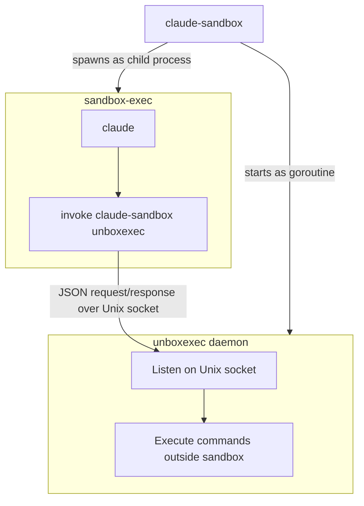

# claude-sandbox

[](https://github.com/kohkimakimoto/claude-sandbox/actions/workflows/test.yml)
[](https://github.com/kohkimakimoto/claude-sandbox/releases)
[](https://github.com/kohkimakimoto/claude-sandbox/blob/main/LICENSE)

A wrapper around Claude Code (`claude` command) to run it in a sandboxed environment using macOS's `sandbox-exec`.

Table of Contents:
- [Why Not the Built-in Sandbox?](#why-not-the-built-in-sandbox)
- [Installation](#installation)
  - [Homebrew](#homebrew)
  - [Build from source](#build-from-source)
- [Usage](#usage)
- [Configuration File](#configuration-file)
  - [Creating a Configuration File](#creating-a-configuration-file)
  - [Example](#example)
  - [`[sandbox]` Section](#sandbox-section)
  - [`[unboxexec]` Section](#unboxexec-section)
  - [Sandbox Profile Parameters](#sandbox-profile-parameters)
  - [Viewing the Sandbox Profile](#viewing-the-sandbox-profile)
  - [Viewing the Effective Configuration](#viewing-the-effective-configuration)
- [Sandbox-External Command Execution](#sandbox-external-command-execution)
  - [The `unboxexec` Subcommand](#the-unboxexec-subcommand)
    - [Options](#options)
    - [Examples](#examples)
  - [Command Restrictions](#command-restrictions)
  - [Architecture](#architecture)
- [Environment Variables](#environment-variables)
- [Agent Skill](#agent-skill)
- [License](#license)


## Why Not the Built-in Sandbox?

Claude Code provides a [built-in sandboxing feature](https://code.claude.com/docs/en/sandboxing) with filesystem and network isolation. I tried it, but in my workflow and environment it wasn't the best fit:

- Unexpected restrictions kept blocking legitimate operations, and I spent a lot of time troubleshooting and working around them.
- I didn't need network isolation at all, so it only added complexity without benefit.

What I actually needed was simpler: **restrict file writes to the current directory** and **explicitly allow exceptions** when needed. So I built this tool — minimal, predictable sandboxing with straightforward configuration.

## Installation

### Homebrew

```bash
brew install kohkimakimoto/tap/claude-sandbox
```

### Build from source

```bash
git clone https://github.com/kohkimakimoto/claude-sandbox.git
cd claude-sandbox
make build
# Binary is at .dev/build/dev/claude-sandbox
```

## Usage

`claude-sandbox` can be used as a drop-in replacement for the `claude` command, but runs in a sandboxed environment that restricts file system write access.

```bash
# Instead of: claude
claude-sandbox

# Instead of: claude --dangerously-skip-permissions
claude-sandbox --dangerously-skip-permissions
```

You can also use the explicit `claude` subcommand. These commands are equivalent to the above:

```bash
claude-sandbox claude
claude-sandbox claude --dangerously-skip-permissions
```

Commands or options that conflict with claude-sandbox's own can be passed using the `claude` subcommand prefix. For example, the following shows the claude help, not the claude-sandbox help:

```bash
claude-sandbox claude -h
```

## Configuration File

Settings are managed through TOML configuration files with three scopes. Each scope overrides the previous one for any field that is explicitly set:

1. **User**: `~/.claude/sandbox.toml` — applies to all projects for the current user
2. **Project**: `.claude/sandbox.toml` in the working directory — project-specific settings checked into version control
3. **Local**: `.claude/sandbox.local.toml` in the working directory — local overrides not meant to be committed (e.g. personal command allowlists)

If no config files exist, built-in defaults are used.

### Creating a Configuration File

Create a project-specific configuration:

```bash
claude-sandbox init
```

This creates `.claude/sandbox.toml` in your current directory.

Create a local override configuration (not for version control):

```bash
claude-sandbox init-local
```

This creates `.claude/sandbox.local.toml` in your current directory. Use this for personal or machine-specific settings that should not be committed. Add it to `.gitignore`.

Create a user-level configuration:

```bash
claude-sandbox init-user
```

This creates `~/.claude/sandbox.toml`.

### Example

```toml
# ~/.claude/sandbox.toml          (user)
# .claude/sandbox.toml            (project)
# .claude/sandbox.local.toml      (local overrides)

[sandbox]
# Sandbox profile for sandbox-exec.
# If not set, the built-in default profile is used.
profile = '''
(version 1)
(allow default)
(deny file-write*)
(allow file-write*
    (subpath (param "WORKDIR"))
    (regex (string-append "^" (param "HOME") "/\\.claude"))
    (subpath "/tmp")
)
'''

# Override working directory (optional).
# workdir = "/path/to/workdir"

# Override claude binary path (optional).
# claude_bin = "/path/to/claude"

[unboxexec]
# Regex patterns for allowed commands.
# The command and its arguments are joined by spaces, and the resulting string
# is matched against each pattern. If any pattern matches, the command is allowed.
# If empty or not configured, all commands are rejected.
allowed_commands = [
    "^playwright-cli",
]
```

### `[sandbox]` Section

| Key | Type | Description |
|-----|------|-------------|
| `profile` | String | The sandbox-exec profile content. If not set, a built-in default profile is used. Use TOML multiline literal strings (`'''`) for readability. |
| `workdir` | String | Override the working directory for sandbox execution. If not set, the current directory is used. |
| `claude_bin` | String | Override the path to the `claude` binary. If not set, it is resolved from PATH. |

### `[unboxexec]` Section

| Key | Type | Description |
|-----|------|-------------|
| `allowed_commands` | Array of strings | Regex patterns that define which commands are allowed to execute via `unboxexec`. The command and arguments are joined with spaces and matched against each pattern. If any pattern matches, the command is permitted. |

For more details, see the [Sandbox-External Command Execution](#sandbox-external-command-execution) section below.

### Sandbox Profile Parameters

The sandbox profile uses parameters that are passed from claude-sandbox automatically:

- `WORKDIR`: The current working directory where claude-sandbox is executed
- `HOME`: The user's home directory

You can use these parameters in your sandbox profile like this:

```scheme
(allow file-write*
    (subpath (param "WORKDIR"))
    (subpath (string-append (param "HOME") "/.claude"))
)
```

### Viewing the Sandbox Profile

You can view the actual profile being used:

```bash
claude-sandbox profile
```

The sandbox uses macOS's `sandbox-exec` (Apple Seatbelt) technology. Even if Claude Code tried to execute a command like `rm -rf /usr/bin` or modify system configuration files, the sandbox would block these operations.

### Viewing the Effective Configuration

You can view the effective configuration (merged from all config files) and see which config files are loaded:

```bash
claude-sandbox config
```

Example output:

```toml
# Loaded config files:
#   user:    /Users/yourname/.claude/sandbox.toml
#   project: .claude/sandbox.toml
#   local:   (none)

[sandbox]
workdir    = ""
claude_bin = ""
profile    = ""

[unboxexec]
allowed_commands = [
  "^playwright-cli",
]
```

## Sandbox-External Command Execution

Some tools (e.g. Playwright) cannot run inside the macOS sandbox because they use their own sandboxing mechanisms, which conflict with the nested sandbox environment.

`claude-sandbox` includes a built-in mechanism called **unboxexec** that allows commands to be executed outside the sandbox. When `claude-sandbox` starts, it launches an internal daemon that accepts command execution requests from inside the sandbox.

### The `unboxexec` Subcommand

The `claude-sandbox unboxexec` subcommand is used from inside the sandbox to execute commands outside of it.

```bash
claude-sandbox unboxexec [options] -- <command> [args...]
```

#### Options

| Flag | Short | Description |
|------|-------|-------------|
| `--dir` | `-C` | Specify the working directory for the command |
| `--timeout` | `-t` | Timeout in seconds (default: 60) |
| `--env` | `-e` | Environment variable in `KEY=VALUE` format (can be specified multiple times) |

#### Examples

```bash
# Execute a command outside the sandbox
claude-sandbox unboxexec -- echo "hello from outside"

# Execute with a specified working directory
claude-sandbox unboxexec --dir /tmp -- ls -la

# Execute with an extended timeout
claude-sandbox unboxexec --timeout 300 -- long-running-command

# Execute with environment variables
claude-sandbox unboxexec --env API_KEY=secret --env DEBUG=1 -- my-command
```

### Command Restrictions

By default, all commands executed via `unboxexec` are **rejected** unless explicitly allowed by the `[unboxexec]` section in the configuration file. See the [`[unboxexec]` Section](#unboxexec-section) for details.

### Architecture

The following diagram shows how sandbox-external command execution is implemented internally.



The `claude-sandbox` process starts the unboxexec daemon as a goroutine, then spawns `sandbox-exec` as a child process. Claude Code running inside the sandbox communicates with the daemon via a Unix Domain Socket to execute commands outside the sandbox.

## Environment Variables

The following environment variables are set by claude-sandbox and available to the Claude Code process running inside the sandbox.

| Variable | Description |
|---|---|
| `CLAUDE_SANDBOX` | Set to `1` inside the sandbox |
| `CLAUDE_SANDBOX_UNBOXEXEC_SOCK` | Path to the unboxexec daemon socket |
| `CLAUDE_SANDBOX_WORKDIR` | Working directory used for sandbox execution |
| `CLAUDE_SANDBOX_CLAUDE_BIN` | Path to the claude binary used |

## Agent Skill

`claude-sandbox` provides an Agent Skill that helps Claude Code understand the sandbox environment — how to check sandbox status, inspect the configuration, and run commands outside the sandbox via `unboxexec`.

The following command outputs the contents of SKILL.md to standard output:

```bash
claude-sandbox skill
```

You can also install the skill in the current project at `.claude/skills/claude-sandbox/SKILL.md` using the following command:

```bash
claude-sandbox skill --install
```

Once installed, Claude Code will automatically load the skill and understand how to work within the sandbox environment.

## License

The MIT License (MIT)

Copyright (c) Kohki Makimoto <kohki.makimoto@gmail.com>
